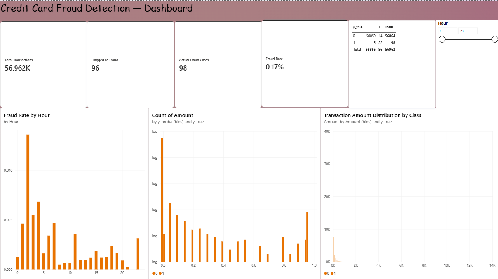
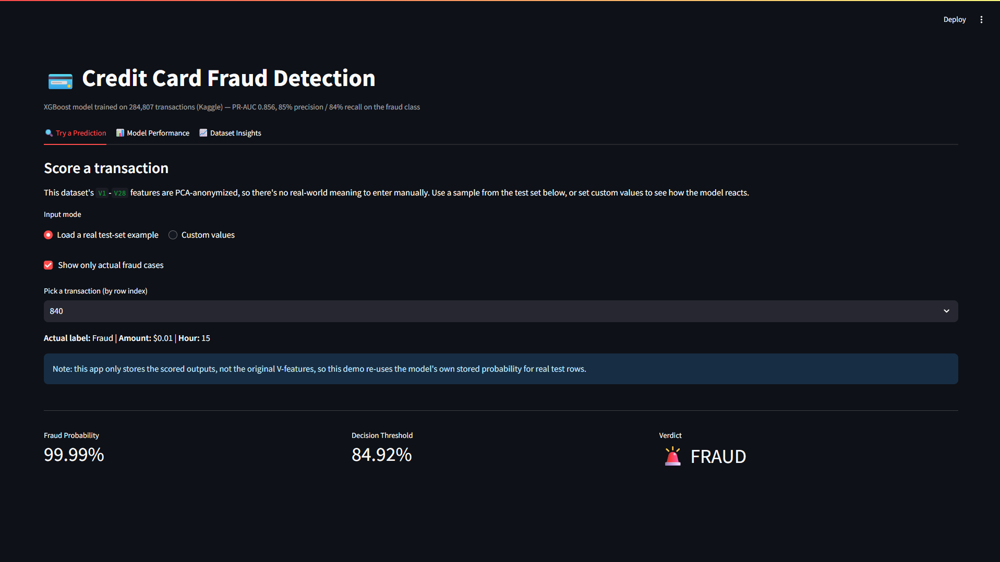

# 💳 Credit Card Fraud Detection

An end-to-end machine learning system that detects fraudulent transactions in real time, built on a highly imbalanced dataset of 284,807 real transactions. Includes a live prediction app and a Power BI analytics dashboard.

**[🔗 Live Demo](your-streamlit-url-here)** | **[📊 Dashboard Screenshots](#dashboard)**

## The Problem

Fraud makes up only **0.17%** of transactions in this dataset (492 out of 284,807). A model that predicts "not fraud" for every single transaction would score **99.8% accuracy** — while catching zero fraud. This project treats accuracy as a misleading metric from the start and optimizes for **precision-recall AUC** instead, since that's what actually matters when the positive class is this rare.

## Results

| Model | PR-AUC | ROC-AUC |
|---|---|---|
| Logistic Regression | 0.775 | 0.971 |
| Random Forest | 0.799 | 0.977 |
| **XGBoost (selected)** | **0.856** | **0.984** |

At a tuned decision threshold, the final XGBoost model achieves:

- **Precision: 85%** — of every 100 transactions flagged, 85 are genuinely fraudulent
- **Recall: 84%** — the model catches 84% of all actual fraud
- Confusion matrix on the held-out test set (56,962 transactions):

|  | Predicted Legit | Predicted Fraud |
|---|---|---|
| **Actual Legit** | 56,850 | 14 |
| **Actual Fraud** | 16 | 82 |

## Approach

- **Class imbalance:** SMOTE oversampling applied *only within training folds* via an `imblearn` pipeline — never on the test set — to avoid data leakage into evaluation.
- **Feature engineering:** extracted `Hour` from the raw `Time` column, standardized `Amount`; the 28 PCA-anonymized `V` features were used as-is.
- **Model selection:** compared Logistic Regression, Random Forest, and XGBoost on PR-AUC rather than accuracy, given the 0.17% positive class rate.
- **Threshold tuning:** selected the decision threshold that maximizes recall while holding precision ≥ 85%, rather than using the default 0.5 cutoff.
- **Deployment-safe artifacts:** model saved in XGBoost's native JSON format (not pickle) to avoid cross-environment version conflicts between the Colab training environment and the deployment environment.

## Live App

Built with Streamlit — score a transaction from the real test set or enter custom feature values, and see the fraud probability, decision threshold, and verdict.

## Dashboard

Built in Power BI from the model's scored test predictions.

- Fraud rate by hour of day
- Transaction amount distribution, fraud vs. legit
- Confusion matrix breakdown
- Fraud probability distribution (log scale) showing class separation

## Tech Stack

`Python` `Pandas` `Scikit-learn` `XGBoost` `imbalanced-learn` `Streamlit` `Power BI` `Matplotlib`

## Project Structure